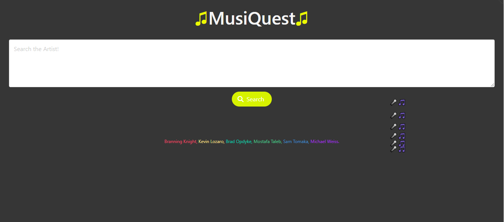
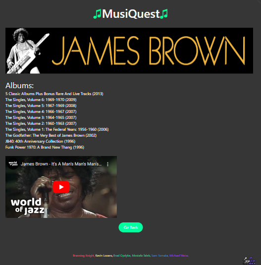

# MuziQuest

## Description

- The motivation behind this project was to create a site for music lovers to find information about their favorite musical artists.
- When the user inputs an artist's name the site will display their discography along with the year that the albums came out.
- We learned a ton about how to use APIs and how to use the Bulma framework.

## Installation

N/A, simply go to the deployed link (https://altavada.github.io/musiquest/)

## Usage

Simply enter the desired musical artist's name into the text box and click the search button.

Then you can see the artist's discography and a video related to them. 

## Credits

#### Developers

- Branning Knight- https://github.com/BranningK
- Kevin Lozaro- https://github.com/klozano17
- Brad Opdyke- https://github.com/bradopdyke
- Mostafa Taleb- https://github.com/Mufasa91
- Sam Tomaka- https://github.com/altavada
- Michael Weiss- https://github.com/Veis1337

If you used any third-party assets that require attribution, list the creators with links to their primary web presence in this section.

- “TheAudioDB API” by TheAudioDB is licensed under CC BY 4.0 (https://www.theaudiodb.com/)
- “YouTube Data API” by Google is licensed under CC BY 4.0 (https://developers.google.com/youtube/v3)
- “Bulma” by Jeremy Thomas is licensed under CC BY-NC-SA 4.0 (https://bulma.io/)

## License

MIT License

Copyright (c) [2023] [Branning Knight, Kevin Lozaro, Brad Opdyke, Mostafa Taleb, Sam Tomaka, Michael Weiss]

Permission is hereby granted, free of charge, to any person obtaining a copy
of this software and associated documentation files (the "Software"), to deal
in the Software without restriction, including without limitation the rights
to use, copy, modify, merge, publish, distribute, sublicense, and/or sell
copies of the Software, and to permit persons to whom the Software is
furnished to do so, subject to the following conditions:

The above copyright notice and this permission notice shall be included in all
copies or substantial portions of the Software.

THE SOFTWARE IS PROVIDED "AS IS", WITHOUT WARRANTY OF ANY KIND, EXPRESS OR
IMPLIED, INCLUDING BUT NOT LIMITED TO THE WARRANTIES OF MERCHANTABILITY,
FITNESS FOR A PARTICULAR PURPOSE AND NONINFRINGEMENT. IN NO EVENT SHALL THE
AUTHORS OR COPYRIGHT HOLDERS BE LIABLE FOR ANY CLAIM, DAMAGES OR OTHER
LIABILITY, WHETHER IN AN ACTION OF CONTRACT, TORT OR OTHERWISE, ARISING FROM,
OUT OF OR IN CONNECTION WITH THE SOFTWARE OR THE USE OR OTHER DEALINGS IN THE
SOFTWARE.
